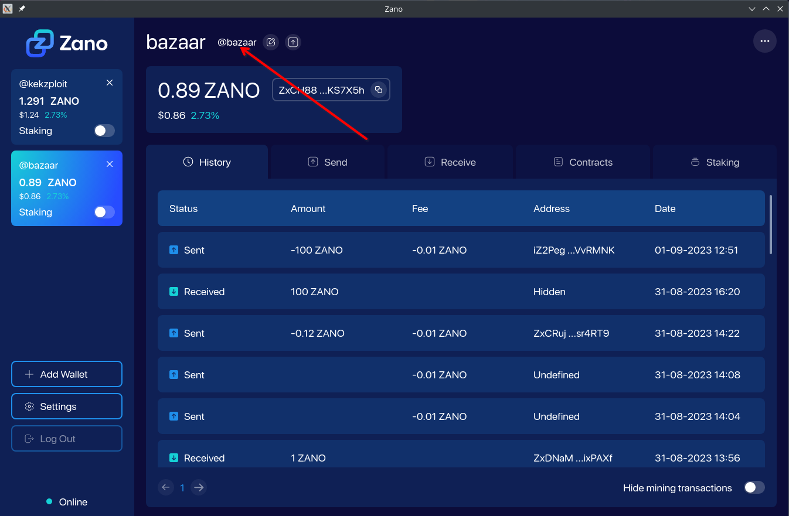
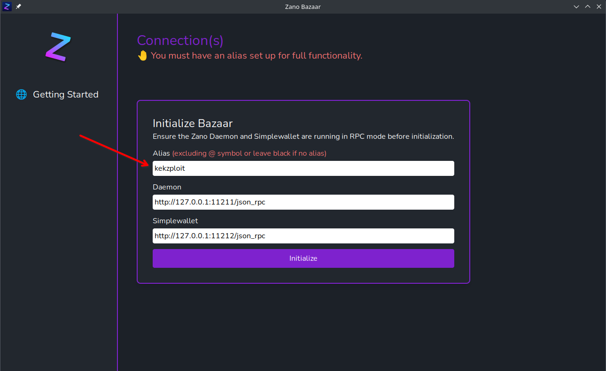
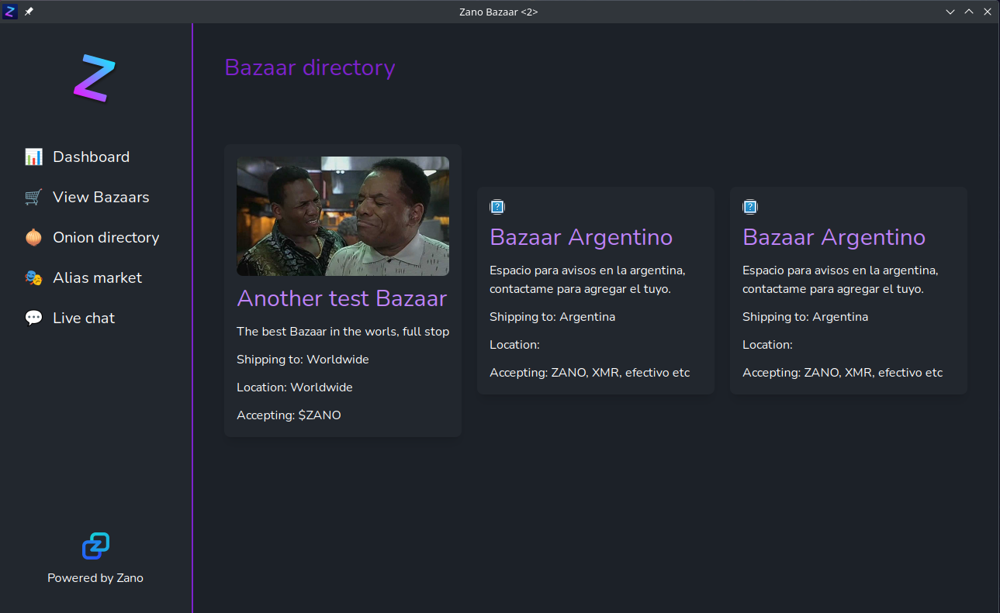

# Zano Bazaar

Zano Bazaar is in Alpha and ready for the Zano community to test and eave some feedback. See below for how to get started.

## 1. Download the Bazaar

We have a Linux binary and Windows .exe file, download the relevant file for your OS. There is also a download packaged with the Zano Daemon and SImplewallet binaries, you'll need those too if you dont have them.

[Releases · zanobazaar/bazaar · GitHub](https://github.com/zanobazaar/bazaar/releases)

## 2. Make sure you have an Alias registered:

The bazaar uses your alias to function, make sure you have one set up!

<div align="center">
    
</div>

## 3. Run Zano Daemon and Simplewallet in RPC mode

Now, unzip/untar the binaries and run them, you can read ho to do this here:

[Run Daemon and SImplewallet in RPC mode](https://docs.zano.org/reference/using-the-zano-api-guide#how-to-run-daemon-in-rpc-mode)

Or, see the following commands:

#### Start Daemon in RPC mode

```bash
./zanod --rpc-bind-ip 127.0.0.1 --rpc-bind-port 11211 --enable-offers-service

```

#### Start Simplewallet in RPC mode

```bash
./simplewallet --wallet-file <wallet>.wallet --password <password> --rpc-bind-ip 127.0.0.1 --rpc-bind-port 11212 --daemon-address 127.0.0.1:11211

```

## 4. Start the Bazaar and enter alias

Ensure you enter your alias WITHOUT the '@' symbol

<div align="center">
    
</div>

## 5. Create Bazaar

Once you have entered your alias, you will then create your bazaar, simply enter the bazaar details. If you dont want to set up a bazaar (not a seller) you can still view in buyer mode using the left sidenav.

<div>
<div align="center">
    
</div>
</div>

# Things to note!

The Bazaar is in alpha, and ready to early test the core functionality by the Zano community, therefore some validations and checks are yet to be implemented, so there are a few things to note

- When creating a Bazaar, the signup for doesnt dissappear until the bazaar is created due to it confirming on the blockchain, so wait a few minutes, if you try multiple times, it will create multiple bazaars.

- There The contact details on the vendors page may intermittently lose its value, this issue is due to the Blockchain and not the Bazaar, this is being looked at by the Zano team, but a fix is on the way

# Providing feedback

If you have had a play with the Bazaar, your feedback is essential, so jump into our Discord where you can find me!

[Zano Bazaar](https://discord.gg/FHjK3SEC)

## Supporting the Bazaars Open Source development

https://www.zanobazaar.com/blog/support


Donation alias: @bazaar

Address: ZxCH88NJ8sc5hs7eZ813BafmEUY7P1p8V4rEa9KndjWAbMNburuqnwXHruYRfwmqY6LF8fbhK8u7vXAusQYWSpiV1o8KS7X5h
